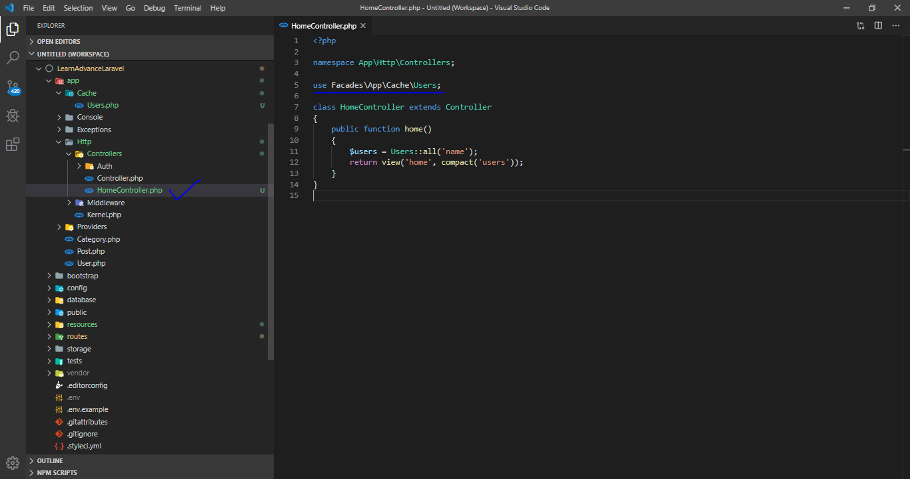

<p align="center">
  
</p>


## Laravel Caching

- Create a folder named it Cache.
- Into the filder create a new file like "Users.php", </br>

See the snapshot bellow.
<p align="left">
  
</p>

## Write the code into `Users.php` file


```php
  <?php
  
  namespace App\Cache;

  use App\User;
  use Carbon\Carbon;

  class Users
  {
        const CACHE_KEY = 'USERS';

        public function all($orderBy)
        {
              $key = "all.{$orderBy}";
              $cacheKey = $this->getCacheKey($key);
              return cache()->remember($cacheKey, Carbon::now()->addMinutes(5), function () use ($orderBy) {
                    return User::orderBy($orderBy)->get();
              });
        }

        public function getCacheKey($key)
        {
              $key = strtoupper($key);
              return self::CACHE_KEY . "$key";
        }
  }
```

<p align="left">
  
</p>
- Go to HomeController and write the code.

```php
<?php

namespace App\Http\Controllers;

use Facades\App\Cache\Users;

class HomeController extends Controller
{
    public function home()
    {
        $users = Users::all('name');
        return view('home', compact('users'));
    }
}
```


