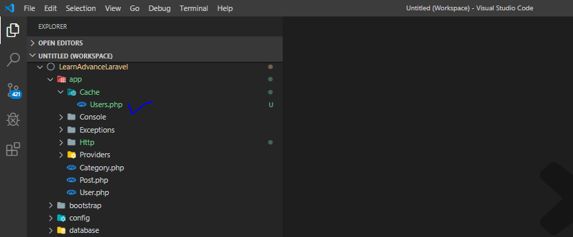

  

## Laravel Caching

- Create a folder named it Cache.
- Into the filder create a new file like "Users.php",  

See the snapshot bellow.

  

<code>
<?php

namespace App\Cache;

use App\User;
use Carbon\Carbon;

class Users
{
      const CACHE_KEY = 'USERS';

      public function all($orderBy)
      {
            $key = "all.{$orderBy}";
            $cacheKey = $this->getCacheKey($key);
            return cache()->remember($cacheKey, Carbon::now()->addMinutes(5), function () use ($orderBy) {
                  return User::orderBy($orderBy)->get();
            });
      }

      public function get($id)
      {
      }

      public function getCacheKey($key)
      {
            $key = strtoupper($key);
            return self::CACHE_KEY . "$key";
      }
}
</code>

- **[Vehikl](https://vehikl.com/)**
- **[Tighten Co.](https://tighten.co)**
- **[Kirschbaum Development Group](https://kirschbaumdevelopment.com)**
- **[64 Robots](https://64robots.com)**
- **[Cubet Techno Labs](https://cubettech.com)**
- **[Cyber-Duck](https://cyber-duck.co.uk)**
- **[British Software Development](https://www.britishsoftware.co)**
- **[Webdock, Fast VPS Hosting](https://www.webdock.io/en)**
- **[DevSquad](https://devsquad.com)**
- [UserInsights](https://userinsights.com)
- [Fragrantica](https://www.fragrantica.com)
- [SOFTonSOFA](https://softonsofa.com/)
- [User10](https://user10.com)
- [Soumettre.fr](https://soumettre.fr/)
- [CodeBrisk](https://codebrisk.com)
- [1Forge](https://1forge.com)
- [TECPRESSO](https://tecpresso.co.jp/)
- [Runtime Converter](http://runtimeconverter.com/)
- [WebL'Agence](https://weblagence.com/)
- [Invoice Ninja](https://www.invoiceninja.com)
- [iMi digital](https://www.imi-digital.de/)
- [Earthlink](https://www.earthlink.ro/)
- [Steadfast Collective](https://steadfastcollective.com/)
- [We Are The Robots Inc.](https://watr.mx/)
- [Understand.io](https://www.understand.io/)
- [Abdel Elrafa](https://abdelelrafa.com)
- [Hyper Host](https://hyper.host)

## Contributing

Thank you for considering contributing to the Laravel framework! The contribution guide can be found in the [Laravel documentation](https://laravel.com/docs/contributions).

## Security Vulnerabilities

If you discover a security vulnerability within Laravel, please send an e-mail to Taylor Otwell via [taylor@laravel.com](mailto:taylor@laravel.com). All security vulnerabilities will be promptly addressed.

## License

The Laravel framework is open-source software licensed under the [MIT license](https://opensource.org/licenses/MIT).
